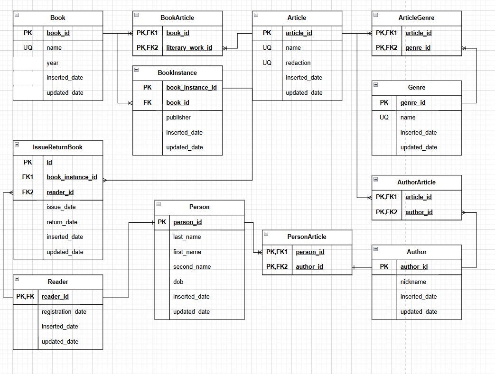

# База Данных для Библиотеки

## ERD
***



## Запуск Docker контейнера

Для запуска выполните команду

```bash
docker compose up -d
```

## Работа с Базой Данных

### Поиск книг по произведению. Доступен как с передачей атрибута redaction, так и без него

```sql
SELECT 
    book_id,
    books_name,
    "year",
    count_instances
FROM library.get_books_by_article('Мастер и Маргарита');

SELECT
    book_id,
    books_name,
    "year",
    count_instances 
FROM library.get_books_by_article('Война и мир', 'Альпина Паблишер');
```

### Поиск книг по автору (по ФИО)

```sql
SELECT 
    book_id,
    books_name,
    "year",
    count_instances 
FROM library.get_books_by_author('Пушкин', 'Александр', 'Сергеевич');
```

### Поиск произведений по автору (по ФИО)

```sql
SELECT
    article_id,
    article_name   
FROM library.get_articles_by_author('Пушкин', 'Александр', 'Сергеевич');
```

### Выдача и возврат книг. Если у читателя нет книги на руках, то происходит выдача, если есть - то возврат. Производится проверка на наличие свободных экземпляров книг, если свободных книг нет, выводится предупреждение.

- выдача экземпляра 1

```sql
CALL library.issue_and_return_books('Сказки А.С. Пушника', '2001', 'Иванов', 'Иван', 'Иванович', '1985-10-12');
```

- выдача экземпляра 2

```sql
CALL library.issue_and_return_books('Сказки А.С. Пушника', '2001', 'Петров', 'Петр', 'Петрович', '1970-04-05');
```

- свободных книг нет

```sql
CALL library.issue_and_return_books('Сказки А.С. Пушника', '2001', 'Васильева', 'Мария', 'Ивановна', '1999-01-01');
```

- возврат экземпляра 1

```sql
CALL library.issue_and_return_books('Сказки А.С. Пушника', '2001', 'Иванов', 'Иван', 'Иванович', '1985-10-12');
```

### Операции с persons

- добавление

```sql
CALL "library".insert_person(8, 'Соболева', 'Анна', 'Викторовна', '20010406'); 
```

- обновление

```sql
CALL "library".update_person(5, 'Смирнов', 'Иван', 'Иванович', '19851012');
```

- удаление

```sql
CALL "library".delete_person(3);
```

### Операции с books

- добавление

```sql
CALL "library".insert_book(8, 'Сказки', '2019');
```

- обновление

```sql
CALL "library".update_book(8,'Сказки на ночь', '2019');
```

- удаление

```sql
CALL "library".delete_book(1);
```

### Представление для просмотра выданных книг с датой выдачи и ориентировочной датой возврата (срок книги на руках - 14 дней)

```sql
SELECT
    book,
    issue_date,
    estimated_return_date
FROM library.v_find_books_issued;
```
